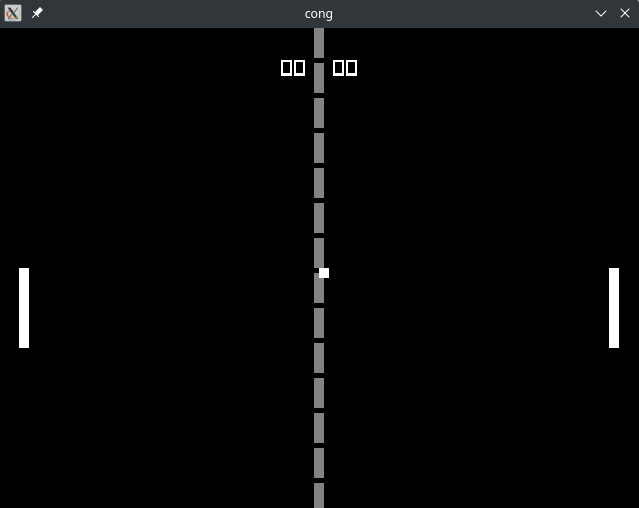

# cong - Pong clone written in C

Pong clone written in C using [Raylib 4.0](www.raylib.com)



## How to build:

- Requires `CMake`, `GNU make` and some flavour of `C` compiler.

**NOTE:** Tested on Arch Linux 5.19.X

```console
git clone https://github.com/mscode98/cong.git
cd cong
mkdir build
cd build
cmake ..
make
./cong
```